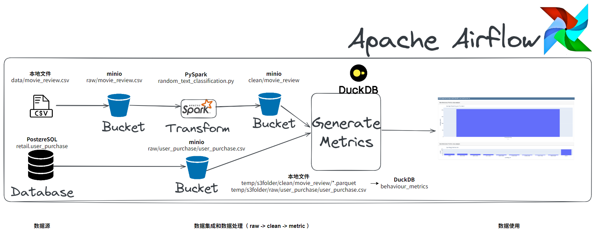
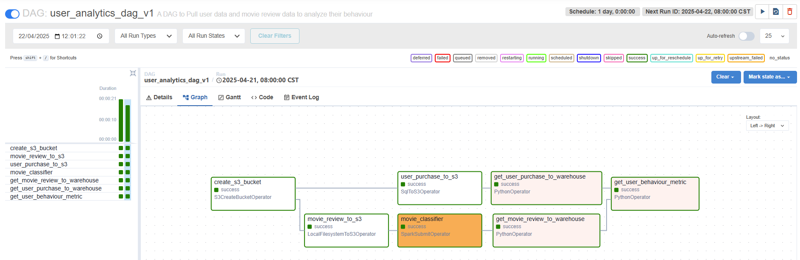
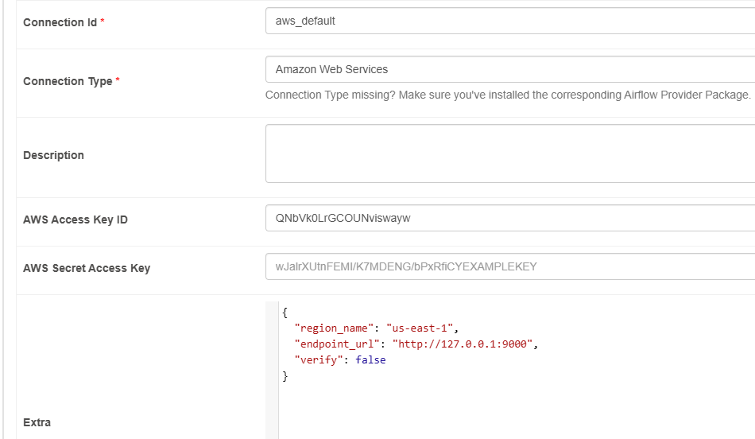
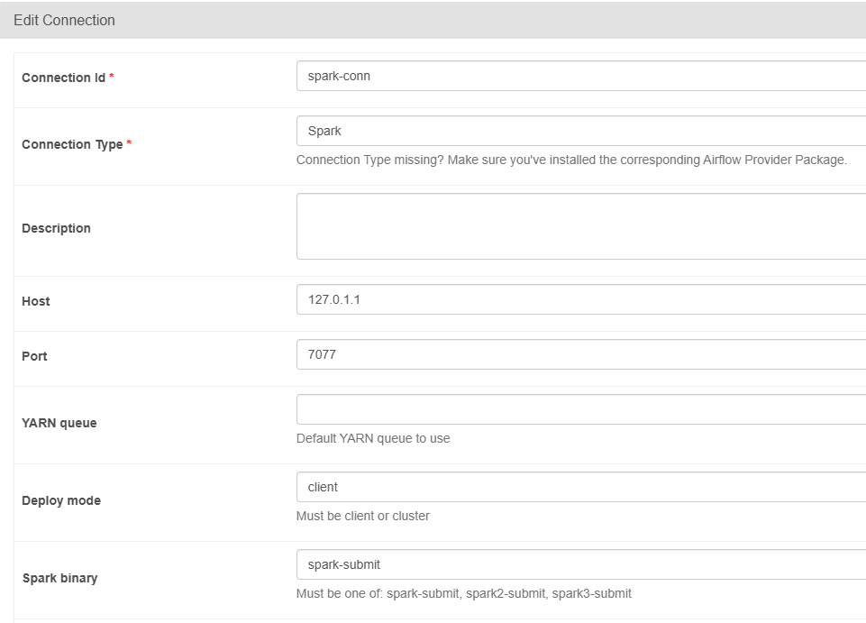
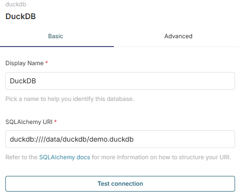

之前在本地搭建了数据湖仓环境（[详情](https://mp.weixin.qq.com/s/lbPMmtUubUbbLmDmnTQ09A)），找了一个新手项目在此环境上练习。


#### **01 介绍**

原项目博客及代码库如下：

https://www.startdataengineering.com/post/data-engineering-project-for-beginners-batch-edition

https://github.com/josephmachado/beginner_de_project


这次练习将**原项目**进行改造，在本地搭建的数据湖仓环境运行。

主要改造的点：

- 在本地搭建的数据湖仓环境运行（原项目使用容器运行）
- 访问 minio 的 token 改为从配置文件获取
- PySpark 任务使用 Spark 集群运行
- metric 部分使用 DuckDB 数据表，不使用 csv 文件
- 展示使用 Superset，不使用 quarto


这次练习的代码库：

https://github.com/panhuida/beginner_de_project_v1

要了解如何运行，从 Airflow 的 DAG 文件 user_analytics_v1.py 开始看。


#### **02 架构**

##### **1.整体的架构及数据流图**



主要组件：

- Minio 作为数据湖存储
- PySpark 用于数据处理
- DuckDB 作为 OLAP 数据存储
- Airflow 用于任务编排
- Superset 制作数据看板


##### **2.Airflow DAG执行示例**




#### **03 改造步骤**

##### 1.安装依赖库

```shell
# 安装 duckdb
(airflow) pan@pan-SER8:/opt/airflow$ cat constraints-3.12.txt | grep duckdb
(airflow) pan@pan-SER8:/opt/airflow$ pip install duckdb

# 一起安装
#pip install apache-airflow[postgres,amazon,apache-spark]==2.10.5 --constraint "https://raw.githubusercontent.com/apache/airflow/constraints-2.10.5/constraints-3.8.txt"

# 安装 apache-airflow-providers-amazon
# https://airflow.apache.org/docs/apache-airflow-providers-amazon/stable/index.html
(airflow) pan@pan-SER8:/opt/airflow$ cat constraints-3.12.txt | grep amazon
(airflow) pan@pan-SER8:/opt/airflow$ pip install apache-airflow-providers-amazon==9.2.0
(airflow) pan@pan-SER8:/opt/airflow$ pip install apache-airflow-providers-amazon[s3fs]  --constraint constraints-3.12.txt 


# 安装 apache-airflow-providers-amazon
# https://airflow.apache.org/docs/apache-airflow-providers-apache-spark/stable/index.html
(airflow) pan@pan-SER8:/opt/airflow$ cat constraints-3.12.txt | grep spark
(airflow) pan@pan-SER8:/opt/airflow$ pip install apache-airflow-providers-apache-spark==5.0.0
```


##### 2.配置

###### postgres 配置

```sql
pan@pan-SER8:~$ psql -h localhost -U molihua -d demo
Password for user molihua: 

demo=> CREATE SCHEMA retail;
CREATE SCHEMA
demo=>
CREATE TABLE retail.user_purchase (
    invoice_number varchar(10),
    stock_code varchar(20),
    detail varchar(1000),
    quantity int,
    invoice_date_str varchar(30),
    unit_price Numeric(8,3),
    customer_id int,
    country varchar(20)
);
demo=>
# 与 SQL 的 COPY 命令不同，\copy 是 psql 客户端的元命令，它会将文件内容从客户端读取并传输到服务器，因此不需要服务器对文件系统的权限
\COPY retail.user_purchase(invoice_number,stock_code,detail,quantity,invoice_date_str,unit_price,customer_id,country) 
FROM '/opt/code/dp/beginner_de_project_local/data/OnlineRetail.csv' DELIMITER ','  CSV HEADER;
COPY 541908
demo=>
# 添加正确格式的日期列
ALTER TABLE retail.user_purchase ADD COLUMN invoice_date timestamp;
demo=>
# 更新日期列（假设是 MDY 格式）
UPDATE retail.user_purchase SET invoice_date = to_timestamp(invoice_date_str, 'MM/DD/YYYY HH24:MI');
UPDATE 541908
```


###### 访问 minio 凭据配置

```shell
pan@pan-SER8:~$ mkdir .aws
pan@pan-SER8:~$ vim .aws/config
[default]
aws_access_key_id=QNbVk0LrGCOUNviswayw
aws_secret_access_key=nLmDKpMnCunZn9UAqf1nSDL279GfA5DaPKduR8st
region=us-east-1
```


###### **Airflow的连接配置**

- 增加postgresql的连接

```shell
# 配置postgresql的连接(也可以在Web UI上配置)
(airflow) pan@pan-SER8:/opt/airflow$ cat constraints-3.12.txt | grep apache-airflow-providers-postgres
#注意：安装 apache-airflow-providers-postgres 6.1.1 不会出现 postgres的连接类型，要按constraints-3.12.tx的版本测试
(airflow) pan@pan-SER8:/opt/airflow$ pip install apache-airflow-providers-postgres==6.0.0
(airflow) pan@pan-SER8:/opt/airflow$ airflow connections add 'postgres_default' \
    --conn-type 'postgres' \
    --conn-host '192.168.31.72' \
    --conn-schema 'demo' \
    --conn-login 'molihua' \
    --conn-password '' \
    --conn-port 5432
```

- 在界面增加连接 aws_default

https://claude.ai/chat/cf762bda-ec68-4af0-b086-31d7e30a711c




- 在界面增加连接 spark-conn




#### 04 运行

```shell
# 项目路径
/opt/code/dp/beginner_de_project_v1

# Airflow
# 在项目主目录启动（考虑到有多个项目测试、练习，故使用以项目为中心使用 Airflow，即不将DAG及相关项目文件放到 Airflow默认的DAG目录中）
# 读取配置文件
export AIRFLOW_HOME=/opt/airflow
# 读取项目DAG文件
# https://airflow.apache.org/docs/apache-airflow/2.10.5/cli-and-env-variables-ref.html
# 环境变量的优先级高于配置文件airflow.cfg
export AIRFLOW__CORE__DAGS_FOLDER=/opt/code/dp/beginner_de_project_v1/dags
(airflow) pan@pan-SER8:/opt/code/dp/beginner_de_project_v1$ airflow webserver --port 8886
(airflow) pan@pan-SER8:/opt/code/dp/beginner_de_project_v1$ airflow scheduler

(airflow) pan@pan-SER8:/opt/code/dp/beginner_de_project_local$ airflow webserver --port 8886
(airflow) pan@pan-SER8:/opt/code/dp/beginner_de_project_local$ airflow scheduler


# DuckDB
pan@pan-SER8:/opt/duckdb$ ./duckdb /data/duckdb/demo.duckdb
v1.2.1 8e52ec4395
Enter ".help" for usage hints.
D select * from behaviour_metrics limit 5;
┌─────────────┬───────────────┬──────────────────────┬─────────────┐
│ customer_id │ amount_spent  │ num_positive_reviews │ num_reviews │
│    int32    │ decimal(20,4) │        int32         │    int32    │
├─────────────┼───────────────┼──────────────────────┼─────────────┤
│       12471 │   805859.5600 │                 6372 │       22833 │
│       13426 │   156230.8000 │                 1590 │        6996 │
│       13211 │    45501.9600 │                  672 │        2128 │
│       17682 │    81157.8900 │                 1071 │        3927 │
│       14156 │  4308597.3200 │                19880 │       53960 │
└─────────────┴───────────────┴──────────────────────┴─────────────┘
```


#### **05 小结**

1.对于一个新的项目，了解如何运行，要找到主线（例如 DAG 文件、Makefile 文件），关注主线的节点。

2.看代码，可以先用 AI 助手解释一下，有个大概的了解。

3.安装 Airflow 扩展包时，注意版本兼容性，按约束文件的版本安装。

4.下载 Spark 的 jar包时，注意版本兼容性。

5.对 “DuckDB 是大数据浏览器” 这句话有点理解了，在这个练习中，DuckDB 直接读取 csv 数据文件和 parquet 数据文件并合并再保存写入（还有直接连接MySQL、PostgreSQL查询或导入数据等）。


#### **06 附录**

##### 1.Superset 连接 DuckDB

- 安装依赖库

```shell
pan@pan-SER8:/opt/superset$ source bin/activate
(superset) pan@pan-SER8:/opt/superset$ pip install duckdb-engine
```

- 增加 DuckDB 的连接

```shell
duckdb:////data/duckdb/demo.duckdb
```



